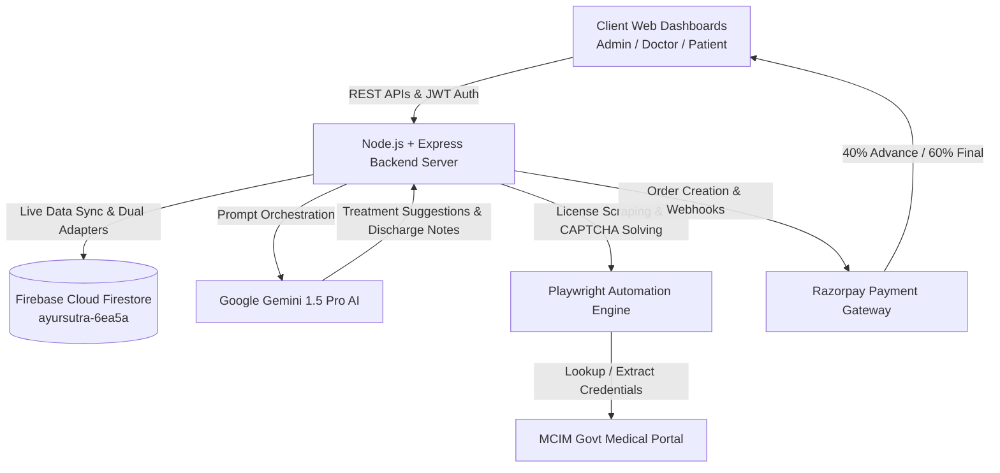

<div align="center">

  

  # 🌿 AyurSutra (आयुर्सूत्र)
  ### *Next-Generation Cloud Panchakarma Clinical Management & AI Diagnostic Platform*

  [](https://nodejs.org/)
  [](https://expressjs.com/)
  [](https://firebase.google.com/)
  [](https://deepmind.google/technologies/gemini/)
  [](https://razorpay.com/)
  [](https://playwright.dev/)
  [](LICENSE)

  <p align="center">
    <b>AyurSutra</b> bridges 5,000 years of classical Ayurvedic science with modern cloud architecture, automated practitioner credentials verification, and multimodal artificial intelligence.
  </p>

  <p align="center">
    <a href="#-key-features">Key Features</a> •
    <a href="#-system-architecture">Architecture</a> •
    <a href="#-quick-start">Quick Start</a> •
    <a href="#-default-credentials">Credentials</a> •
    <a href="#-api-reference">API Reference</a> •
    <a href="#-contributing">Contributing</a>
  </p>

</div>

---

## 🌟 Executive Overview

**AyurSutra** is an enterprise-grade, cloud-native Panchakarma Patient Management System purpose-built for Ayurvedic hospitals, wellness clinics, and independent Vaidyas. It automates the entire clinical lifecycle — from patient triage, AI-assisted therapy selection, and automated government medical council (MCIM) license verification, to multi-tier milestone billing, real-time schedule orchestration, and post-therapy recovery telemetry.

---

## 🚀 Key Features

<table>
  <tr>
    <td width="50%">
      <h3>👨‍⚕️ Intelligent Doctor Workspace</h3>
      <ul>
        <li><b>Dynamic Itinerary & Session Control:</b> 1-click status transitions (<code>Scheduled</code> ➔ <code>Ongoing</code> ➔ <code>Completed</code>) with real-time patient updates.</li>
        <li><b>Digital Clinical Journal:</b> Document pulse diagnosis (<i>Nadi Pariksha</i>), Prakriti imbalance, and herbal prescriptions.</li>
        <li><b>AI Discharge Summary Generator:</b> Instant compilation of formal medical summaries powered by Google Gemini Pro.</li>
        <li><b>Patient Search & Roster Directory:</b> Real-time search by patient name, contact, or therapy regimen.</li>
      </ul>
    </td>
    <td width="50%">
      <h3>🧘 Patient Healing Portal</h3>
      <ul>
        <li><b>Holistic Therapy Booking:</b> Browse and request 16+ authentic procedures (<i>Vamana, Virechana, Basti, Shirodhara, Nasya, etc.</i>).</li>
        <li><b>AI Ayurvedic Symptom Triage:</b> Interactive symptom assessment suggesting tailored Panchakarma therapies with clinical rationale.</li>
        <li><b>Recovery Feedback Telemetry:</b> Daily Pain (1-10), Energy (1-10), and Satisfaction scorecards synced to practitioner view.</li>
        <li><b>24/7 AI Health Companion:</b> Conversational chatbot for dietary guidelines (<i>Pathya / Apathya</i>) and post-session care.</li>
      </ul>
    </td>
  </tr>
  <tr>
    <td width="50%">
      <h3>🛡️ Government Medical License Verification</h3>
      <ul>
        <li><b>MCIM Automated Verification:</b> Background headless verification engine checking doctor registration against the Maharashtra Council of Indian Medicine (MCIM).</li>
        <li><b>Intelligent Mathematical CAPTCHA Solver:</b> Automated optical parsing & solution handling.</li>
        <li><b>Multi-Tier Cache Architecture:</b> High-speed memory and Firestore caching preventing duplicate scraping lookups.</li>
      </ul>
    </td>
    <td width="50%">
      <h3>💳 Dual-Milestone Razorpay Billing</h3>
      <ul>
        <li><b>40% Advance Deposit:</b> Instant order creation and token reservation upon therapy acceptance.</li>
        <li><b>60% Post-Therapy Settlement:</b> Automated remaining balance collection post-session or offline cash verification.</li>
        <li><b>Cryptographic Signature Verification:</b> Secure webhook & SHA-256 HMAC integrity checks.</li>
      </ul>
    </td>
  </tr>
</table>

---

## 🏛️ System Architecture



---

## 💻 Tech Stack & Infrastructure

| Layer | Technologies |
| :--- | :--- |
| **Frontend UI** | HTML5, CSS3 (Soft UI Evolution & Glassmorphism), Modern Vanilla JavaScript, Bootstrap 5.3, Bootstrap Icons |
| **Backend API** | Node.js (v18+), Express.js, REST Architecture, JWT Authentication, Bcrypt Password Hashing |
| **Database** | **Firebase Cloud Firestore** (Native Admin SDK v14) with multi-engine fallback to MySQL |
| **Artificial Intelligence** | **Google Gemini 1.5 Pro API** (Diagnostic matching, NLP chatbot, and Clinical Discharge Summaries) |
| **Web Scraping & Automation** | **Playwright Headless Browser Engine** with regex parsing & arithmetic CAPTCHA solver |
| **Payment Infrastructure** | **Razorpay Payment Gateway SDK** (Order generation, signature verification, split payments) |

---

## 🛠️ Quick Start

### 1. Prerequisites
- **Node.js** (v18.0.0 or higher)
- **Firebase Account** (free tier Cloud Firestore)

### 2. Clone the Repository
```bash
git clone https://github.com/omrahatal14-sketch/AyurSutra.git
cd AyurSutra
```

### 3. Install Dependencies
```bash
npm install
```

### 4. Configure Environment
Create a `.env` file in the root directory (or copy `.env.example`):
```ini
PORT=3000
DB_TYPE=firebase
FIREBASE_PROJECT_ID=your-project-id
JWT_SECRET=ayursutra_secret_key_2026
GEMINI_API_KEY=your_gemini_api_key_here
RAZORPAY_KEY_ID=your_razorpay_key_id
RAZORPAY_KEY_SECRET=your_razorpay_key_secret
```

### 5. Link Firebase Credentials
1. Navigate to **[Firebase Console](https://console.firebase.google.com/)** ➔ **Project Settings** ➔ **Service Accounts**.
2. Click **Generate new private key** and download the JSON.
3. Save the file in the project root as `serviceAccountKey.json`.
4. *(Optional visual guide: read [FIREBASE_SETUP_GUIDE.md](FIREBASE_SETUP_GUIDE.md))*

### 6. Seed & Initialize Database
```bash
npm run db:init-firebase
```

### 7. Launch AyurSutra
```bash
npm start
```
> Server will boot at **`http://localhost:3000`** with full Firestore connectivity.

---

## 🔐 Default Credentials

| Role | Email | Password | Access Rights |
| :--- | :--- | :--- | :--- |
| **Administrator** | `omrahatal@gmail.com` | `omrahatal` | Full platform control, MCIM approvals, clinic revenue, broadcasts |
| **Doctor** | `doctor@ayursutra.com` | `doctor123` | Session control, daily notes, AI discharge maker, patient triage |
| **Patient** | *Register new account via signup* | *User password* | Session tracking, AI symptom triage, Razorpay checkout, feedback |

---

## 📂 Project Directory Structure

```
AyurSutra/
├── css/
│   └── style.css                 # Master Design System (Soft UI, Ayurvedic Color Tokens)
├── js/
│   ├── firebase-sql-mock.js      # Client-side Firestore Data Bridge
│   ├── firebase.js               # Firebase Web SDK Configuration
│   ├── guard.js                  # Client Route Protection (JWT RBAC)
│   ├── logout.js                 # Session Cleanup Helper
│   └── verifyDoctors.js          # Admin Doctor Verification Controller
├── server/
│   ├── routes/
│   │   ├── auth.js               # JWT Signup / Login (Bcrypt Hash)
│   │   ├── users.js              # User Management & Status Endpoints
│   │   ├── patients.js           # Clinical Patient Registry
│   │   ├── sessions.js           # Session Scheduling & Lifecycle
│   │   ├── requests.js           # Patient Therapy Booking Requests
│   │   ├── feedbacks.js          # Post-Therapy Recovery Telemetry
│   │   ├── notifications.js      # Clinic Broadcast Messaging
│   │   ├── payments.js           # Razorpay 40/60 Split Billing API
│   │   └── verifyDoctor.js       # Playwright MCIM Scraper Controller
│   ├── utils/
│   │   └── bootstrap.js          # Root Super-Admin Firestore Bootstrapper
│   ├── db.js                     # Unified Multi-DB Engine Selector
│   ├── firestore.js              # Firebase Admin SDK Adapter & CRUD Helpers
│   └── server.js                 # Express Application Entry Point
├── admin.html                    # Administrator Operations Dashboard
├── doctor.html                   # Doctor Clinical Suite
├── patient.html                  # Patient Healing Portal
├── login.html                    # Unified Authentication Portal
├── signup.html                   # Multi-Role Onboarding Portal
├── init-firebase.js              # Database Seeder & Mock Data Provisioner
├── FIREBASE_SETUP_GUIDE.md       # Visual Firebase Deployment Guide
└── README.md                     # Project Documentation
```

---

## 🌿 Panchakarma Therapies Catalog

AyurSutra comes pre-configured with clinical fee structures and indications for 16 classical therapies:

| Therapy | Sanskrit Term | Primary Indication | Standard Fee |
| :--- | :--- | :--- | :--- |
| **Panchakarma (Complete)** | पंचकर्म | Complete 5-phase cellular detoxification | `₹12,000` |
| **Vamana** | वमन | Kapha elimination & respiratory disorders | `₹7,000` |
| **Virechana** | विरेचन | Pitta detoxification & dermatological care | `₹6,500` |
| **Basti** | बस्ति | Vata alleviation & neuromusculoskeletal care | `₹6,000` |
| **Shirodhara** | शिरोधारा | Continuous warm oil stream for insomnia & stress | `₹4,000` |
| **Nasya** | नस्य | Headaches, sinusitis, & cervical stiffness | `₹4,500` |
| **Kati Basti** | कटि बस्ति | Localized warm oil retention for lumbar spine | `₹3,500` |
| **Abhyanga** | अभ्यंग | Medicated herbal warm oil body massage | `₹2,500` |

---

## 🤝 Contributing

Contributions are warmly welcomed! Please follow these steps:
1. **Fork** the project repository.
2. **Create a feature branch**: `git checkout -b feature/AmazingFeature`
3. **Commit your changes**: `git commit -m "feat: add AmazingFeature"`
4. **Push to the branch**: `git push origin feature/AmazingFeature`
5. **Open a Pull Request**.

---

## 📜 License

Distributed under the **MIT License**. See `LICENSE` for more information.

---

<div align="center">
  <sub>Built with ❤️ for the global advancement of authentic Ayurvedic science.</sub>
</div>
